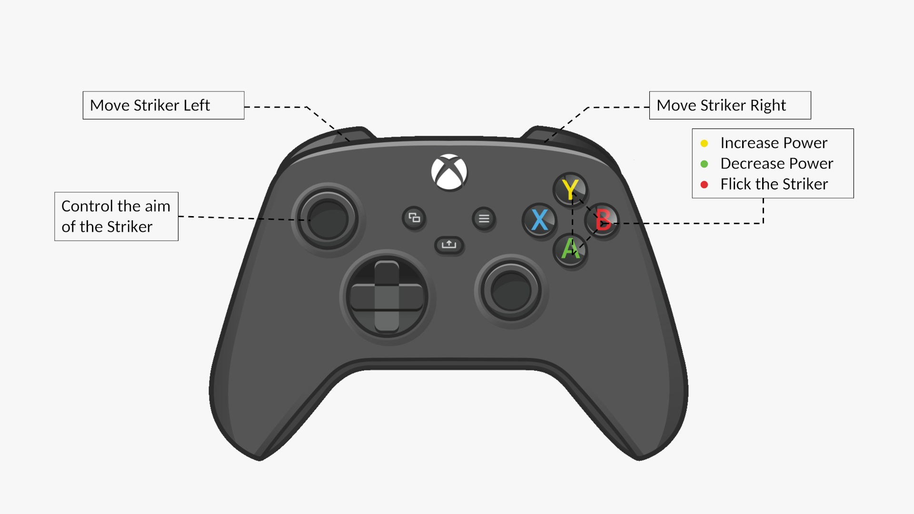

<p align="center">
   
</p>

<h4 align="center">
   A Classic Multiplayer 2D Carrom game implemented in OpenGL and FreeGLUT.
</h4>

<hr>

## Features
- **Multiplayer modes**: Engage in matches with friends and family in both two-player and four-player modes.
- **Intuitive controls**: Flick the striker with precision using user-friendly controls.
- **Controller support**: Play the game using either a game controller or the keyboard for a personalized gaming experience.
- **Smooth graphics**: Immerse yourself in the game's smooth visuals powered by OpenGL.
- **Realistic collisions**: Experience the dynamic interactions between pieces and the board.
- **Real-time score tracking**: The score board provides a dynamic and real-time display of the current scores for each player or team throughout the game.
- **Turn indicator**: An indicator highlights the active player or team, ensuring understanding of the game progression and whose turn it is at any given moment.

## How to Play

1. Choose your preferred game mode: single-player, two-player, or four-player (accessible via the right-click menu in the game interface). The default mode is set to two-player.
2. Each player takes turns flicking the striker to pocket their assigned color coins into the corner pockets.
3. The player who skillfully pockets the coins into the corner pots earns points.
4. The game continues until a maximum score of 50 points is reached.
5. The team with the highest score at the end of the game wins.

## Controls

[](https://commons.wikimedia.org/wiki/File:Xbox_Controller.svg)

| Control             | Keyboard  | Controller |
|---------------------|-----------|------------|
| Aim Striker         | Left      | LS         |
| Aim Striker         | Right     | LS         |
| Increase Power      | Up        | Y          |
| Decrease Power      | Down      | A          |
| Flick Striker       | Space Bar | B          |
| Shift Striker Left  | A         | LB         |
| Shift Striker Right | D         | RB         |

> **Note**: The controls have been specifically tested on an Xbox 360 controller. The functionality and compatibility with other controllers are not guaranteed.

## Installation

Pre-built binaries for Linux and Windows are provided in the [releases](https://github.com/hyPnOtICDo0g/Carrom2D/releases/latest) section.

## Build

1. Clone the repository:

```
git clone https://github.com/hyPnOtICDo0g/Carrom2D.git
```
2. Install the required dependencies and build the game:

### For Linux (Ubuntu / Debian)

```sh
chmod +x scripts/build.sh
./scripts/build.sh
```

> **Note**: The script assumes that `gcc` and `gold` are installed and available on `PATH`.

### For Windows

```sh
pwsh .\scripts\build.ps1
```

4. Run the executable:

```
make run
```

## Credits

- Repo logo designed by [SBTS2018 / Flaticon](https://www.flaticon.com/free-icon/carrom_2961480)
- Xbox Series X/S controller illustration by [Atharva Jumde
](https://dribbble.com/shots/15044335-Xbox-Series-X-Controller)
